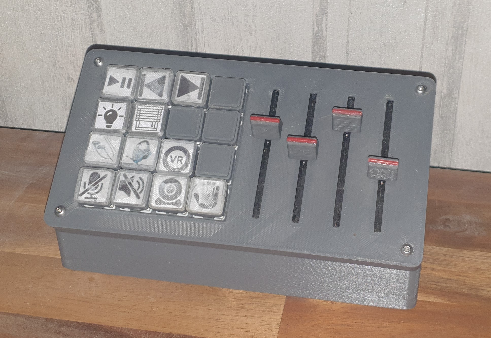

# MyStreamdeck
DIY Streamdeck-like pc peripheral for hotkeys and volume control.  

Useful for media-control, home automation and hotkeys for muting / deafening in Discord or Zoom.

# Material
- Arduino Pro Micro
- 16x Keyswitches
- 16x Diode e.g. 1N4148
- 4 B10K slide potentiometer 75mm
- Some Wire with and without dupont connectors
- a USB A to USB Micro B Cable 
- 4x M3x8mm Screws
- 4x M3 heatset inserts
- ~0.5kg PLA for most of the components
- Some transparent PLA for the keycap covers
- Some PLA as an accent color for the volume slider head
- Some sand to fill the bottom to make it heavier
- Hotglue

# 3D-Printing
 You will need to print:
 - 1x main body.stl
 - 1x top plate.stl
 - 1x sand divider.stl
 - 1x cable holder.stl
 - 16x keycap bottom.stl
 - 16x keycap top.stl in transparent PLA
 - 4x slider top.stl

# Wiring
- Pin Numbers are the same as those written on the Arduino Pro Micro
- Connect the same 5V and GND to all volumesliders. 
- Connect the leftmost volumeslider output to Pin A0, ..., and the rightmost volumeslider output to Pin A3.
- Connect the topmost row of buttons to Pin 6, ..., and the bottommost row of buttons to Pin 9.
- Connect the leftmost column of buttons to Pin 2, ..., and the rightmost column of buttons to Pin 5. Place a diode inline for each button with the cathode facing the Arduino.

# Configuration
Configuration is mainly done in settings.json.  
- You need to set the correct COM Port of the Arduino. To find the correct one, use Windows Device Manager to see which COM Port changes when unplugging and plugging it back in.

- Specify for each volume slider which application volume it should control.    
Like this: `"volumeSlider0": "master"`, or `"volumeSlider1": ["firefox.exe", "chrome.exe"]`.
Application names can be found by running `python listAudioSources.py` while the intended application is playing audio. "master" is the global audio level.
- If you intend to use MQTT you need to enter brokerAdress and brokerPort

- Hotkey functions need to be configured in code

# Photo

The icons look a little scuffed because i used (probably the wrong) glue to hold them in place.